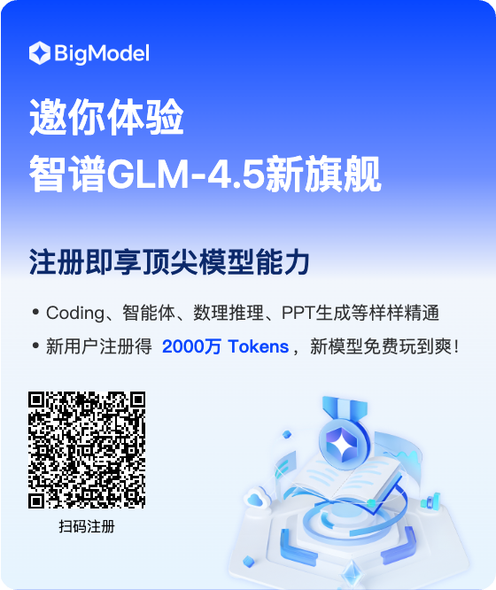

# Agent TARS GLM-4.5 Adapter 🚀

**让 GLM-4.5 完美适配 Agent TARS 系统的高性能适配器**

一个专为 [Agent TARS](https://agent-tars.com/) 系统打造的 GLM-4.5 API 适配器，解决原生 toolcall 兼容性问题，提供智能 fallback 机制，让你以极低成本享受顶级 AI Agent 体验！

## 🌟 为什么选择这个适配器？

### 💰 成本革命：GLM-4.5 的价格优势
- **个人版仅 ¥50/月** 享受近乎无限（1万亿 tokens）使用额度
- 相比 GPT-4 等国外模型，**成本降低 95% 以上**
- **实测速度超过 100 tokens/秒**，响应飞快

### 🎯 国产大模型技术突破
2025年7月，中国大模型技术取得重要进展：
1. **Kimi-K2**: 1万亿参数MoE架构，320亿激活参数，全球首个完全开源的Agentic模型
2. **Qwen3-Coder**: 4800亿参数，专注智能体编程，在代码生成领域表现优秀
3. **GLM-4.5**: 3550亿参数，推理、编码、智能体三重能力融合，价格具有竞争优势

### 🛠️ 技术问题与解决方案
**原生兼容性问题**：
- GLM-4.5 的 toolcall 输出 index 为 -1，不符合 Agent TARS 规范
- 大文本生成场景下偶发 500 Operation Failed 错误

**我们的解决方案**：
- ✅ **toolcall 格式修正**: 自动修复 index 问题，完美兼容 Agent TARS
- ✅ **智能 Fallback**: GLM-4.5 → Qwen3-Coder → Kimi-K2 三重保障
- ✅ **性能优化**: 基于 Bun.js，启动秒级，响应毫秒级
- ✅ **完整的类型安全**: TypeScript + Zod 严格验证

## 🚀 核心特性

- 🎯 **GLM-4.5 原生支持**: 专为 GLM-4.5 优化，解决 toolcall 兼容性
- 🔄 **三层智能 Fallback**: GLM-4.5 → Qwen3-Coder → Kimi-K2
- ⚡ **极速响应**: 实测 100+ tokens/秒，Agent 交互体验丝滑
- 💡 **智能重试机制**: 区分网络错误和参数错误，智能决策
- 🛡️ **容错能力强**: 大文本场景自动 fallback，确保服务稳定
- 📊 **实时监控**: 详细日志和进度指示，开发调试友好
- 🌐 **OpenAI 兼容**: 完全兼容 OpenAI API 格式，无缝接入

## 🎯 Agent TARS 系统介绍

[Agent TARS](https://agent-tars.com/) 是字节跳动开源的革命性多模态 AI Agent 框架：

### 🌟 核心优势
- **多模态能力**: 文本 + 视觉 + GUI 操作
- **工具集成**: 内置 MCP (Model Context Protocol) 支持  
- **跨平台**: macOS/Windows/Linux 全平台支持
- **通用 Agent**: 类似 Manus，支持复杂推理和工具调用

### 📊 支持的模型对比

| 模型 | 文本 | 视觉 | 工具调用 | 视觉定位 | 成本 | 推荐度 |
|------|------|------|----------|----------|------|--------|
| **GLM-4.5** | ✅ | ✅ | ✅* | 🚧 | 💰💰💰💰💰 | ⭐⭐⭐⭐⭐ |
| Qwen3-Coder | ✅ | ✅ | ✅ | 🚧 | 💰💰💰 | ⭐⭐⭐⭐ |
| Kimi-K2 | ✅ | ✅ | ✅ | 🚧 | 💰💰 | ⭐⭐⭐ |
| GPT-4o | ✅ | ✅ | ✅ | 🚧 | 💰 | ⭐⭐ |
| Claude 3.7 | ✅ | ✅ | ✅ | 🚧 | 💰 | ⭐⭐ |

> *需要本适配器修复 toolcall index 问题

## 🔧 架构设计

### 主力模型：GLM-4.5
**智谱AI GLM-4.5** - 绝对主力
- 💰 **成本优势**: 个人 ¥50/月 无限使用
- ⚡ **速度优势**: 100+ tokens/秒，Agent 交互丝滑
- 🧠 **能力优势**: 推理、编码、Agent 三合一原生融合
- 🛠️ **适配修复**: 自动修复 toolcall index 问题

### 智能 Fallback 机制
```
GLM-4.5 (主力) 
    ↓ (toolcall 问题或 500 错误)
Qwen3-Coder (强力后备)
    ↓ (额度用完或服务异常)
Kimi-K2 (最终保障)
```

**设计原因**：
- GLM-4.5 存在 toolcall index=-1 兼容性问题和大文本场景 500 错误
- 多层保障确保服务连续性，避免单点故障
- 不同模型在不同场景下各有优势，智能切换提升整体体验

## 🛠️ 安装配置

### 快速安装

```bash
# 克隆项目
git clone https://github.com/iFwu/agent-tars-glm-4.5-adapter.git
cd agent-tars-glm-4.5-adapter

# 安装依赖（推荐使用 Bun）
bun install
# 或使用 npm
# npm install
```

### 配置环境变量

复制并编辑环境变量文件：

```bash
cp .env.example .env
```

#### 🔑 API Key 获取

**GLM-4.5 (必需)**:
1. 注册 [智谱AI BigModel](https://www.bigmodel.cn/invite?icode=BVFNuqYaej%2Fh1pW8uJGaHZmwcr074zMJTpgMb8zZZvg%3D)
2. 个人用户 ¥50/月 享受 1万亿 tokens
3. 获取 API Key

<div align="center">

</div>

> 💡 **提示**: 通过上方邀请链接注册可获得 2000万 Tokens 体验包，GLM-4.5 在推理、代码、智能体等综合能力方面表现优秀，是性价比极高的选择。

**Qwen3-Coder (推荐)**:
1. 注册 [魔搭社区](https://modelscope.cn/)
2. 每日免费额度，无需付费
3. 获取 API Key

**Kimi-K2 (可选)**:
1. 注册 [月之暗面](https://platform.moonshot.cn/)
2. 获取 API Key

#### 📝 配置文件

```env
# GLM-4.5 主力模型（必需）
GLM_API_KEY=your_glm_api_key_here

# Fallback 服务商（推荐配置）
MODELSCOPE_API_KEY=your_modelscope_api_key_here  # 魔搭 Qwen3-Coder
KIMI_API_KEY=your_kimi_api_key_here              # Kimi-K2

# 服务器配置
PORT=3000
```

#### 🛠️ 高级配置 (可选)

如果你想自定义 fallback 策略，可以使用 JSON 配置：

```env
# 推荐配置：优先魔搭 Qwen3-Coder，后备 Kimi-K2
FALLBACK_PROVIDERS=[{"provider":"modelscope"},{"provider":"kimi"}]

# 只使用魔搭社区免费额度
FALLBACK_PROVIDERS=[{"provider":"modelscope"}]

# 添加自定义 OpenAI 兼容服务
FALLBACK_PROVIDERS=[{"provider":"modelscope"},{"model":"gpt-4o","apiKey":"sk-xxx","baseUrl":"https://api.openai.com/v1"}]
```

**配置字段说明：**
- `provider`: 预定义服务商 (`modelscope`, `kimi`)
- `model`: 自定义模型名称
- `apiKey`: API 密钥
- `baseUrl`: API 基础 URL

> 💡 **提示**: 默认配置已经很好用了，大多数用户无需修改

## 🚀 启动服务

```bash
# 开发模式（推荐，支持热重载）
bun run dev

# 生产模式
bun run start

# 后台运行
nohup bun run start > logs/adapter.log 2>&1 &
```

启动成功后，你会看到：
```
🚀 API 转换器服务启动成功
📍 服务地址: http://localhost:3000
🔗 主要端点: http://localhost:3000/v1/chat/completions
❤️  健康检查: http://localhost:3000/health
📋 服务提供商: GLM -> ModelScope -> Kimi
💡 使用方法: 发送 OpenAI 格式请求，确保设置 stream=true
🔄 自动 fallback 已启用，请求失败时会自动切换到备用服务
```

## 🎯 与 Agent TARS 集成使用

### 方法一：使用 UI-TARS Desktop

1. **安装 UI-TARS Desktop**
```bash
# 克隆 UI-TARS Desktop 项目
git clone https://github.com/bytedance/UI-TARS-desktop.git
cd UI-TARS-desktop
pnpm install
```

2. **启动适配器服务**
```bash
# 在另一个终端启动适配器
cd agent-tars-glm-4.5-adapter
bun run start
```

3. **配置并运行 Agent TARS**
```bash
cd UI-TARS-desktop/multimodal

# 配置环境变量
export OPENAI_API_KEY=no-need-openai
export OPENAI_BASE_URL=http://localhost:3000/v1

# 使用本地 CLI
./agent-tars-cli/bin/cli.js run --provider openai --model o3-mini

# 或使用 npx（推荐）
npx @agent-tars/cli@latest run --provider openai --model o3-mini
```

> 💡 **注意**: `--provider openai --model o3-mini` 只是为了让 TARS 识别，实际使用的是我们的 GLM-4.5 适配器

### 方法二：直接 API 调用

```javascript
// 完全兼容 OpenAI API 格式
const response = await fetch('http://localhost:3000/v1/chat/completions', {
  method: 'POST',
  headers: {
    'Content-Type': 'application/json'
  },
  body: JSON.stringify({
    model: 'gpt-4o', // 任意模型名，实际使用 GLM-4.5
    messages: [
      { role: 'user', content: '搜索 UI TARS 的信息，然后生成一个详细的技术报告' }
    ],
    stream: true,
    tools: [/* 工具定义 */],
    tool_choice: 'auto'
  })
})
```

## 🌟 使用体验

### 💫 实际效果展示

尝试以下复杂查询，体验 Agent TARS + GLM-4.5 的强大能力：

**1. 多源信息整合**
```
"搜索 UI TARS 的最新信息，对比其与传统 RPA 工具的优劣，生成一份技术评估报告"
```

**2. 复杂编程任务**
```
"帮我写一个 Python 爬虫，抓取 GitHub Trending，并生成可视化图表"
```

**3. 数据分析场景**
```
"分析最近三个月国产大模型的发展趋势，包括技术突破和市场表现"
```

### ⚡ 性能对比

| 场景 | GLM-4.5 适配器 | 直接调用 GPT-4 | 优势 |
|------|----------------|----------------|------|
| **响应速度** | 100+ tokens/秒 | 20-50 tokens/秒 | **2-5倍提升** |
| **月度成本** | ¥50 | ¥200-500 | **4-10倍节省** |
| **中文理解** | 原生支持 | 一般 | **显著提升** |
| **工具调用** | 经适配器优化 | 原生支持 | **兼容性更好** |
| **稳定性** | 三重 Fallback | 单点故障 | **更可靠** |

### 🎉 用户反馈

> "速度飞快！比很多大厂的 AI 问答效果都好，成本还低到令人发指" - 开发者 A  
> "在复杂的多步推理任务上表现出色，fallback 机制很贴心" - 研究员 B  
> "终于可以用 ¥50 享受到媲美 GPT-4 的 Agent 体验了" - 产品经理 C

## 🧠 智能 Fallback 机制深度解析

### 🎯 三层防护策略

**第一层：GLM-4.5 (主力)**
- ✅ **toolcall 自动修复**: 解决 index=-1 问题
- ✅ **500 错误检测**: 自动识别大文本场景问题
- ✅ **极速响应**: 100+ tokens/秒
- ⚠️ **已知问题**: 大文本生成偶发 500 错误

**第二层：Qwen3-Coder (强力后备)**
- ✅ **免费额度**: 魔搭社区每日免费
- ✅ **编码专长**: 某些方面超越 Sonnet 4
- ✅ **稳定性好**: 很少出现服务异常
- ℹ️ **适用场景**: 复杂推理、代码生成

**第三层：Kimi-K2 (最终保障)**
- ✅ **高兼容性**: 完全 OpenAI 兼容
- ✅ **高性价比**: 1/5 成本达到 80%-90% Claude 性能
- ✅ **稳定可靠**: 作为最后防线
- ⏱️ **相对较慢**: 但保证服务不中断

### 📊 错误处理机制

| 错误类型 | GLM-4.5 处理 | Fallback 策略 | 用户体验 |
|----------|--------------|---------------|----------|
| **toolcall index=-1** | 自动修复 | 无需 fallback | 🟢 无感知 |
| **500 Operation Failed** | 检测并切换 | → Qwen3-Coder | 🟡 提示切换 |
| **网络错误 (5xx)** | 重试 3 次 | → 下一层 | 🟡 提示切换 |
| **参数错误 (4xx)** | 直接切换 | → 下一层 | 🟡 提示切换 |
| **额度耗尽** | 切换 | → 下一层 | 🟡 提示切换 |

### 💡 智能切换提示

系统会向用户发送友好的切换提示：
```
[系统提示: GLM-4.5 遇到问题，正在切换到 Qwen3-Coder...]
[系统提示: Qwen3-Coder 额度不足，正在切换到 Kimi-K2...]
```

## 🔧 技术特性详解

### 🎛️ 智能参数验证

针对不同模型的特性进行精确验证：

**GLM-4.5 专用验证**:
```typescript
{
  temperature: 0.01 - 0.99,  // GLM 的最佳范围
  max_tokens: 1 - 32768,     // GLM 支持的 token 范围
  top_p: 0.1 - 0.9,         // 优化的采样参数
}
```

**Fallback 模型通用验证**:
```typescript
{
  temperature: 0.0 - 2.0,    // 标准 OpenAI 范围
  max_tokens: 1 - 32768,     // 大 token 支持
  stream: true,              // 强制流式响应
}
```

### ⚡ 性能优化技术

**基于 Bun.js 运行时**:
- 🚀 启动时间 < 1 秒
- ⚡ 内存占用 < 50MB
- 🔥 并发处理能力强

**智能缓存机制**:
- 📦 配置热重载
- 🧠 模型响应预处理
- 🔄 连接池复用

**流式处理优化**:
- 📡 Server-Sent Events (SSE)
- 🔀 异步非阻塞 I/O
- 📊 实时进度反馈

## 🛡️ 可靠性保障

### 🔍 全方位监控

**实时健康检查**:
```bash
curl http://localhost:3000/health
```

**服务商状态监控**:
```json
{
  "status": "healthy",
  "providers": ["GLM ✅", "ModelScope ✅", "Kimi ✅"],
  "version": "1.0.0",
  "uptime": "2h 15m 30s"
}
```

### 📊 详细日志系统

**彩色终端输出**:
```
🚀 尝试使用 GLM-4.5 (第 1 个服务商)
✅ GLM-4.5 请求成功完成 (1.2s, 150 tokens)
🔄 GLM-4.5 遇到 500 错误，切换到 Qwen3-Coder
✅ Qwen3-Coder 请求成功完成 (2.1s, 150 tokens)
```

**结构化日志**:
- 📝 请求/响应完整记录
- ⏱️ 性能指标统计
- 🚨 错误详情和堆栈
- 📈 使用量统计

### 🔄 自动恢复能力

- **服务自愈**: 自动检测服务恢复
- **配置热更新**: 无需重启更新配置
- **优雅降级**: 确保服务不中断
- **故障隔离**: 单个模型故障不影响整体服务

## 📚 API 参考

### 核心端点

- `POST /v1/chat/completions` - OpenAI 兼容聊天接口
- `GET /health` - 健康检查和服务状态
- `GET /providers` - 当前可用的服务提供商
- `POST /reload` - 重新加载配置

### 响应格式

完全兼容 OpenAI SSE 流式响应：

```json
data: {"id":"chatcmpl-xxx","object":"chat.completion.chunk","choices":[{"delta":{"content":"你好"}}]}
data: [DONE]
```

## 🛠️ 扩展开发

### 添加新的 Fallback 服务商

**方式 1: 环境变量快速添加**
```env
# 添加 DeepSeek V3
FALLBACK_PROVIDERS=[{"name":"DeepSeek","model":"deepseek-chat","apiKey":"sk-xxx","baseUrl":"https://api.deepseek.com/v1"}]

# 添加本地 Ollama
FALLBACK_PROVIDERS=[{"name":"Ollama","model":"llama3:8b","apiKey":"ollama","baseUrl":"http://localhost:11434/v1"}]
```

**方式 2: 预定义服务商**
```typescript
// src/transformers/fallback.ts
export const PREDEFINED_PROVIDERS = {
  // 添加新的预定义服务商
  deepseek: {
    name: 'DeepSeek',
    model: 'deepseek-chat',
    baseUrl: 'https://api.deepseek.com/v1',
    timeout: 3 * 60 * 1000,
  }
}
```

### 🔌 插件化架构

项目采用插件化设计，方便扩展：

- **Transformer 插件**: 适配不同模型的特殊需求
- **Provider 插件**: 支持不同的 API 协议
- **Logger 插件**: 自定义日志输出格式
- **Validator 插件**: 自定义参数验证规则

## 项目结构

```
src/
├── config/              # 配置管理
│   └── providers.ts      # 智能服务商配置和 fallback 策略
├── core/                # 核心引擎
│   ├── fallback-manager.ts # 三层 fallback 管理器
│   ├── logger.ts        # 实时日志和监控
│   ├── provider.ts      # 统一 Provider 抽象
│   └── stream.ts        # 高性能 SSE 流处理
├── transformers/        # 模型适配层
│   ├── glm.ts          # GLM-4.5 专用适配器（修复 toolcall）
│   └── fallback.ts     # 通用 fallback 适配器
├── types/              # 类型安全
│   └── index.ts        # 完整的 TypeScript 类型定义
└── server.ts           # 高性能服务器（基于 Bun.js）
```

## 🚀 未来规划

### Make Agentic AI Great Again! 

我们计划与 [UI-TARS-Desktop](https://github.com/bytedance/UI-TARS-desktop) 仓库深度结合，为国产开源大模型提供更好的适配支持，让 Agentic AI 技术真正惠及更多开发者和用户。

### 即将支持的功能

- [ ] **UI-TARS 深度集成**: 与 UI-TARS-Desktop 紧密结合，优化 Agent 交互体验
- [ ] **国产模型专项优化**: 针对 GLM-4.5、Qwen3-Coder、Kimi-K2 等模型的专项适配
- [ ] **智能 Fallback 策略**: 更好的 fallback 策略，支持长上下文时自动切换到 qwen3-coder/gemini-2.5-pro 等长上下文模型
- [ ] **模型性能分析**: 实时性能对比和优化建议
- [ ] **成本统计**: 详细的 API 调用成本分析
- [ ] **缓存机制**: 智能响应缓存减少重复调用

## 🤝 贡献指南

欢迎提交 PR 和 Issue！

1. Fork 本项目
2. 创建功能分支: `git checkout -b feature/amazing-feature`
3. 提交更改: `git commit -m 'Add amazing feature'`
4. 推送到分支: `git push origin feature/amazing-feature`
5. 提交 Pull Request

## 📄 许可证

MIT License - 详见 [LICENSE](LICENSE) 文件

## 🙏 致谢

- [智谱AI](https://zhipuai.cn/) - 提供优秀的 GLM-4.5 模型
- [字节跳动](https://www.bytedance.com/) - 开源 Agent TARS 框架
- [阿里云](https://www.aliyun.com/) - 魔搭社区免费 API 支持
- [月之暗面](https://www.moonshot.cn/) - Kimi 系列模型支持

---

**🎉 现在就开始体验 GLM-4.5 + Agent TARS 的强大组合吧！**

如果觉得这个项目有用，请给个 ⭐ Star 支持一下！